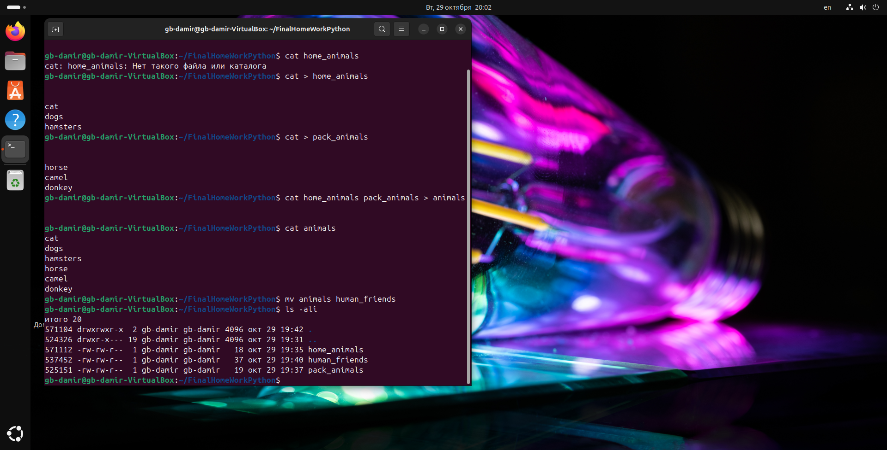
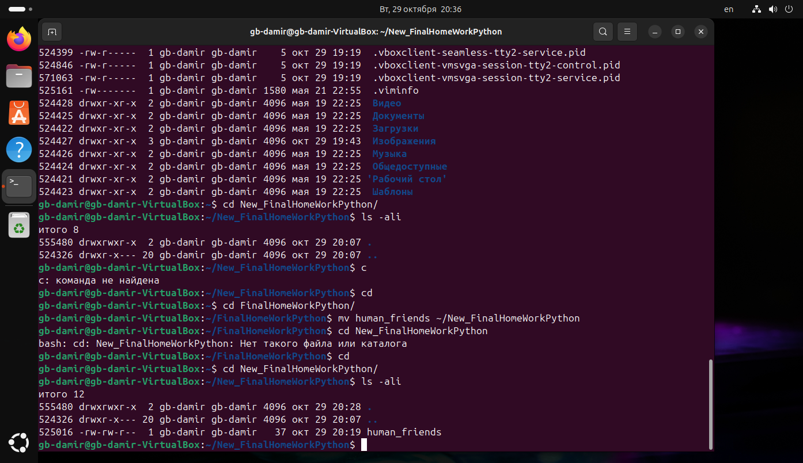
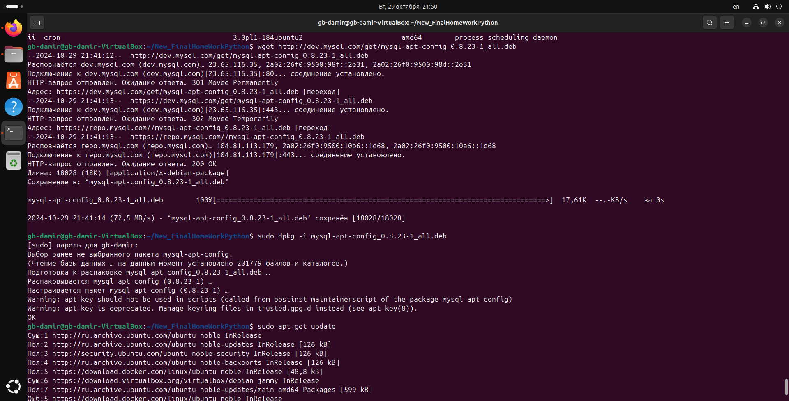
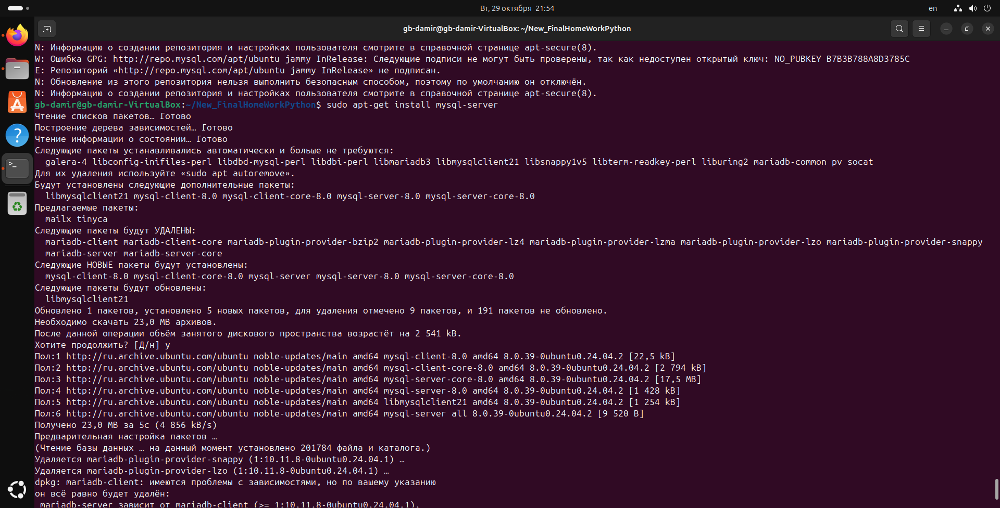
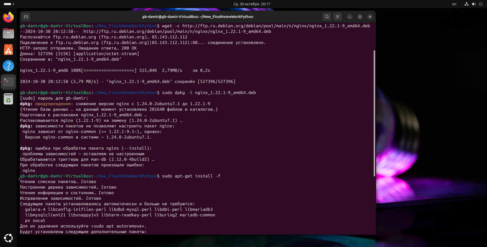
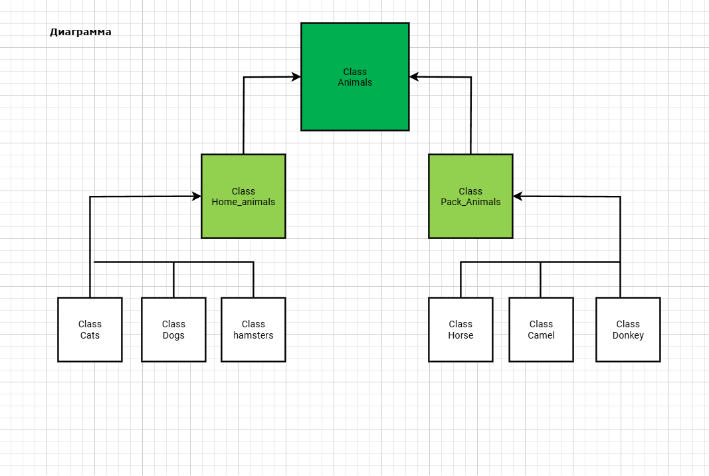
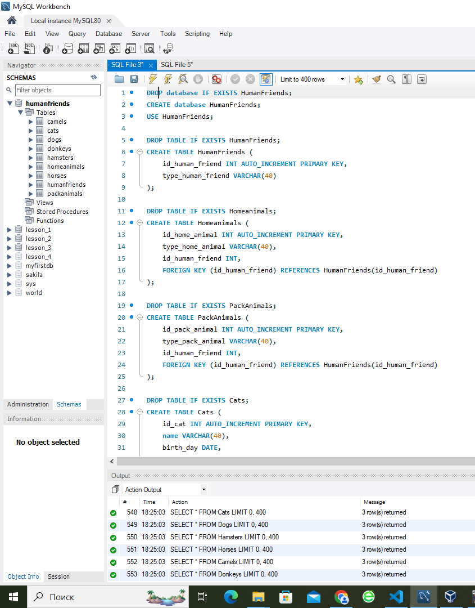

# Итоговая контрольная работа

***Информация о проекте:
Необходимо организовать систему учета для питомника в котором живут
домашние и вьючные животные.***

## Задание
1. Используя команду cat в терминале операционной системы Linux, создать
два файла Домашние животные (заполнив файл собаками, кошками,
хомяками) и Вьючные животными заполнив файл Лошадьми, верблюдами и
ослы), а затем объединить их. Просмотреть содержимое созданного файла.
Переименовать файл, дав ему новое имя (Друзья человека).

```sh 
mkdir FinalHomeWorkPython
cd FinalHomeWorkPython
cat > home_animals
cats
dogs
hamsters
cat > pack_animals
horse
camel
donkey
cat home_animals pack_animals > animals
cat animals
mv animals human_friends
```



2. Создать директорию, переместить файл туда.

```sh 
mkdir New_FinalHomeWorkPython
mv human_friends ~/New_FinalHomeWorkPython
cd New_FinalHomeWorkPython
ls -ali
```



3. Подключить дополнительный репозиторий MySQL. Установить любой пакет
из этого репозитория.

```sh 
sudo wget http://dev.mysql.com/get/mysql-apt-comfig_0.8.23-1_all.deb
sudo dpkg -i mysql-apt-comfig_0.8.23-1_all.deb
sudo apt-get update
sudo apt-get install mysql-server
```






4. Установить и удалить deb-пакет с помощью dpkg.

```sh 
wget -c http://ftp.ru.debian.org/debian/pool/main/n/nginx/nginx_1.22.1-9_amd64.deb
sudo dpkg -i nginx_1.22.1-9_amd64.deb
sudo apt-get install -f
sudo dpkg -r nginx nginx-common
```



5. Выложить историю команд в терминале ubuntu

[Cсылка на историю команд](History_Command_Ubuntu_Linax_Terminal.md)


6. Нарисовать диаграмму, в которой есть класс родительский класс, домашние
животные и вьючные животные, в составы которых в случае домашних
животных войдут классы: собаки, кошки, хомяки, а в класс вьючные животные
войдут: Лошади, верблюды и ослы.




7. В подключенном MySQL репозитории создать базу данных “Друзья
человека”

```sh 
CREATE DATABASE Human_friends;
```

8. Создать таблицы с иерархией из диаграммы в БД

```sh 
DROP database IF EXISTS HumanFriends;
CREATE database HumanFriends;
USE HumanFriends;

DROP TABLE IF EXISTS HumanFriends;
CREATE TABLE HumanFriends (
    id_human_friend INT AUTO_INCREMENT PRIMARY KEY,
    type_human_friend VARCHAR(40)
);

DROP TABLE IF EXISTS Homeanimals;
CREATE TABLE Homeanimals (
    id_home_animal INT AUTO_INCREMENT PRIMARY KEY,
    type_home_animal VARCHAR(40),
    id_human_friend INT,
    FOREIGN KEY (id_human_friend) REFERENCES HumanFriends(id_human_friend)
);

DROP TABLE IF EXISTS PackAnimals;
CREATE TABLE PackAnimals (
    id_pack_animal INT AUTO_INCREMENT PRIMARY KEY,
    type_pack_animal VARCHAR(40),
    id_human_friend INT,
    FOREIGN KEY (id_human_friend) REFERENCES HumanFriends(id_human_friend)
);

DROP TABLE IF EXISTS Cats;
CREATE TABLE Cats (
    id_cat INT AUTO_INCREMENT PRIMARY KEY,
    name VARCHAR(40),
    birth_day DATE,
    commands TEXT,
    id_home_animal INT,
    FOREIGN KEY (id_home_animal) REFERENCES Homeanimals(id_home_animal)
);

DROP TABLE IF EXISTS Dogs;
CREATE TABLE Dogs (
    id_dog INT AUTO_INCREMENT PRIMARY KEY,
    name VARCHAR(40),
    birth_day DATE,
    commands TEXT,
	id_home_animal INT,
    FOREIGN KEY (id_home_animal) REFERENCES Homeanimals(id_home_animal)
);

DROP TABLE IF EXISTS Hamsters;
CREATE TABLE Hamsters (
    id_hamster INT AUTO_INCREMENT PRIMARY KEY,
    name VARCHAR(40),
    birth_day DATE,
    commands TEXT,
	id_home_animal INT,
    FOREIGN KEY (id_home_animal) REFERENCES Homeanimals(id_home_animal)
);

DROP TABLE IF EXISTS Horses;
CREATE TABLE Horses (
    id_horse INT AUTO_INCREMENT PRIMARY KEY,
    name VARCHAR(40),
    birth_day DATE,
    commands TEXT,
    id_pack_animal INT,
    FOREIGN KEY (id_pack_animal) REFERENCES PackAnimals(id_pack_animal)
);

DROP TABLE IF EXISTS Camels;
CREATE TABLE Camels (
    id_camel INT AUTO_INCREMENT PRIMARY KEY,
    name VARCHAR(40),
    birth_day DATE,
    commands TEXT,
    id_pack_animal INT,
    FOREIGN KEY (id_pack_animal) REFERENCES PackAnimals(id_pack_animal)
);

DROP TABLE IF EXISTS Donkeys;
CREATE TABLE Donkeys (
    id_donkey INT AUTO_INCREMENT PRIMARY KEY,
    name VARCHAR(40),
    birth_day DATE,
    commands TEXT,
    id_pack_animal INT,
    FOREIGN KEY (id_pack_animal) REFERENCES PackAnimals(id_pack_animal)
);
```




9. Заполнить низкоуровневые таблицы именами(животных), командами
которые они выполняют и датами рождения

```sh 
INSERT INTO HumanFriends (type_human_friend) VALUES ('HomeAnimal'), ('PackAnimal');
INSERT INTO HomeAnimals (type_home_animal, id_human_friend) VALUES ('Cat', 1), ('Dog', 1), ('Hamster', 1);
INSERT INTO PackAnimals (type_pack_animal, id_human_friend) VALUES ('Horse', 2), ('Camel', 2), ('Donkey', 2);
INSERT INTO Cats (name, birth_day, commands, id_home_animal) 
VALUES
('Рыжий', '2001-01-01', 'сидеть, работай', 1),
('Черный', '2001-01-02', 'сидеть, лежать', 1),
('Белый', '2023-01-03', 'сидеть, дарова', 1);
INSERT INTO Dogs (name, birth_day, commands, id_home_animal) 
VALUES 
('Шарик', '2002-02-02', 'взять, умри', 2),
('Кубик', '2002-02-03', 'взять, фас', 2),
('Ромбик', '2023-02-04', 'взять, лежать', 2);
INSERT INTO Hamsters (name, birth_day, commands, id_home_animal) 
VALUES 
('Обжора', '2003-03-03', 'спать', 3),
('Лентяй', '2003-03-04', 'спать', 3),
('Соня', '2023-03-05', 'спать', 3);
INSERT INTO Horses (name, birth_day, commands, id_pack_animal) 
VALUES 
('Мустанг', '2024-04-04', 'Рысью', 1),
('Чувак', '2022-04-05', 'Голопом', 1),
('Фернандо', '2004-04-06', 'Улыбнись', 1);
INSERT INTO Camels (name, birth_day, commands, id_pack_animal) 
VALUES 
('Губастый', '2022-05-05', 'пошёл', 2),
('Носастый', '2023-05-06', 'пошёл', 2),
('Горбатый', '2005-05-07', 'пошёл', 2);
INSERT INTO Donkeys (name, birth_day, commands, id_pack_animal) 
VALUES 
('Иа', '2006-06-06', 'танцуй', 3),
('Винни', '2024-06-07', 'ко мне', 3),
('Пяточок', '2023-06-08', 'В атаку!', 3);

SELECT * FROM HumanFriends;
SELECT * FROM HomeAnimals;
SELECT * FROM PackAnimals;
SELECT * FROM Cats;
SELECT * FROM Dogs;
SELECT * FROM Hamsters;
SELECT * FROM Horses;
SELECT * FROM Camels;
SELECT * FROM Donkeys;
```


10. Удалить из таблицы верблюдов, т.к. верблюдов решили перевезти в другой
питомник на зимовку. Объединить таблицы лошади, и ослы в одну таблицу.

```sh 
SET SQL_SAFE_UPDATES = 0;
DELETE FROM Camels;
SELECT * FROM Camels;

DROP TABLE IF EXISTS HorsesAndDonkeys;
CREATE TABLE HorsesAndDonkeys AS
SELECT id_horse AS id, name, birth_day, commands, 'Horse' AS type FROM Horses
UNION
SELECT id_donkey AS id, name, birth_day, commands, 'Donkey' AS type FROM Donkeys;
SELECT * FROM HorsesAndDonkeys;
```


11. Создать новую таблицу “молодые животные” в которую попадут все
животные старше 1 года, но младше 3 лет и в отдельном столбце с точностью
до месяца подсчитать возраст животных в новой таблице

```sh 
DROP TABLE IF EXISTS YoungAnimals;
CREATE TABLE YoungAnimals AS
SELECT id, name, birth_day, commands, type, TIMESTAMPDIFF(MONTH, birth_day, CURDATE()) AS age_in_months
FROM (
    SELECT id_cat AS id, name, birth_day, commands, 'Cat' AS type FROM Cats UNION ALL
    SELECT id_dog AS id, name, birth_day, commands, 'Dog' AS type FROM Dogs UNION ALL
    SELECT id_hamster AS id, name, birth_day, commands, 'Hamster' AS type FROM Hamsters UNION ALL
    SELECT id AS id, name, birth_day, commands, type FROM HorsesAndDonkeys AS AllAnimals
WHERE TIMESTAMPDIFF(MONTH, birth_day, CURDATE()) BETWEEN 12 AND 36;

SELECT * FROM YoungAnimals;
```


12. Объединить все таблицы в одну, при этом сохраняя поля, указывающие на
прошлую принадлежность к старым таблицам.

```sh 

```

13. Создать класс с Инкапсуляцией методов и наследованием по диаграмме.

```sh 

```

14. Написать программу, имитирующую работу реестра домашних животных.
В программе должен быть реализован следующий функционал:

* 14.1 Завести новое животное
* 14.2 определять животное в правильный класс
* 14.3 увидеть список команд, которое выполняет животное
* 14.4 обучить животное новым командам
* 14.5 Реализовать навигацию по меню

15. Создайте класс Счетчик, у которого есть метод add(), увеличивающий̆
значение внутренней̆int переменной̆на 1 при нажатие “Завести новое
животное” Сделайте так, чтобы с объектом такого типа можно было работать в
блоке try-with-resources. Нужно бросить исключение, если работа с объектом
типа счетчик была не в ресурсном try и/или ресурс остался открыт. Значение
считать в ресурсе try, если при заведения животного заполнены все поля.